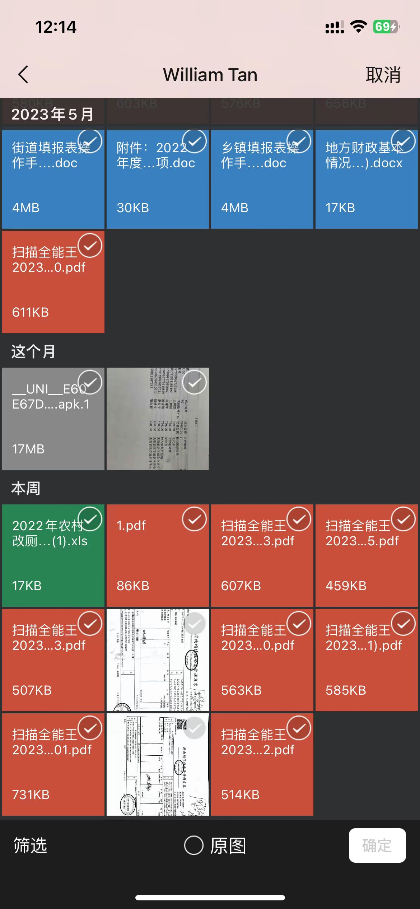
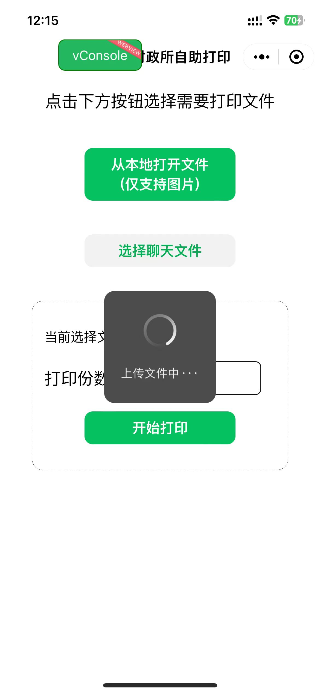
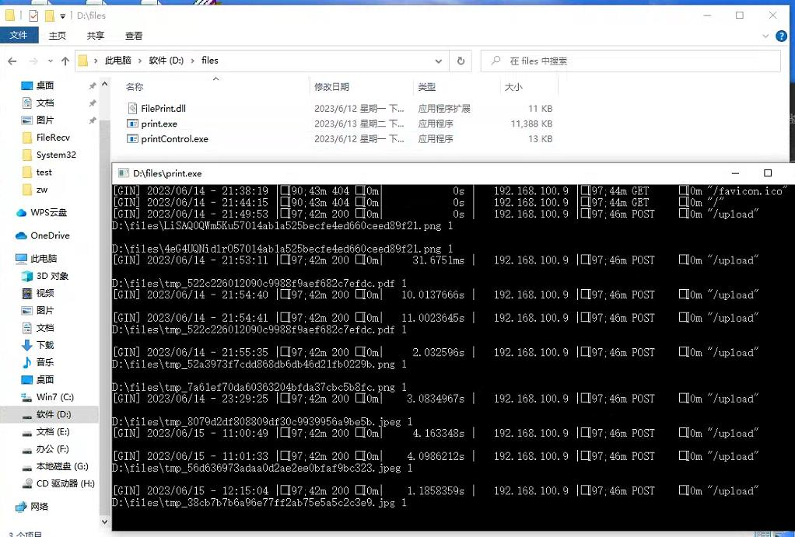

# 小程序远程调用打印机
## 说明
为了解决频繁从微信下载文件到本地打印的需求，于是写了一个可以直接分享文件到小程序并进行打印的demo（注意，仅是demo，更多功能将创造其它分支在后续进行完善）  
该套程序包括：打印机控制驱动（目前仅支持Windows），打印机打印控制程序（C++编写），打印机服务端（golang编写，用于服务小程序交互，通过gin框架监听http），打印机小程序前端（TS版小程序）  
特别说明：没有用golang直接调用dll，而是调用打印机打印控制程序，​因为不想写（懒），所以直接命令行调用  
不足：电脑端暂时选择本地图片，无法感知打印机打印进度，因此只能设置提交打印任务后固定时间删除文件（因win32API无此功能，后续可以根据文件大小及类型估算打印时间）
## 目录说明
1. [打印控制驱动（C++编写）](./PrintControl)  
2. [打印机打印程序（C++编写）](./FilePrint)  
3. [打印机服务端（golang编写）](./goPrintserver)  
4. [打印机客户端(微信小程序TS版)](./miniprogram)  
5. [服务端release](./Release)  
## 效果一览
### 小程序首页：

### 选择聊天记录:

### 上传页:

### 服务端接受到请求:

## 部署说明:
1. 将release文件下载，在USB连接打印机的电脑上运行Print.exe  
2. 将小程序源码上传地址修改为你的IP地址（可以用花生壳之类的做外网映射）  
